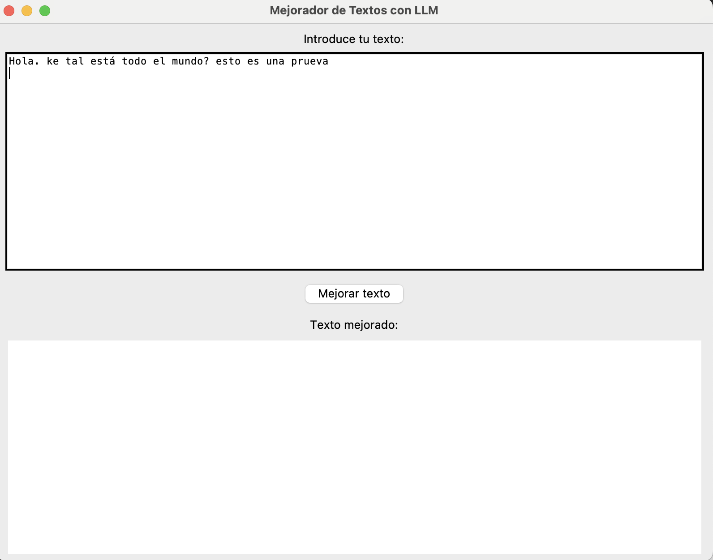
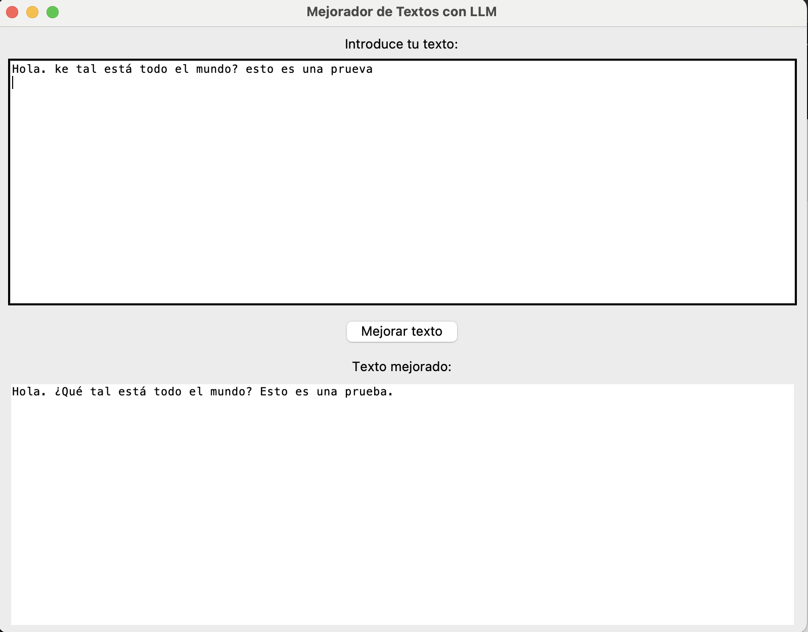

# 📚 LLM Text Improver App

## ✅ Overview
This application enhances and corrects user-inputted texts using a locally running LLM (Mistral-7B-Instruct). It features a graphical interface built with Gradio and does not rely on external APIs.

# 🧠 Aplicación de Mejora de Textos con Mistral-7B-Instruct (GGUF)

## 📌 Descripción del Proyecto

Esta aplicación permite a cualquier usuario mejorar y corregir un texto en español utilizando un modelo LLM local: **Mistral-7B-Instruct-v0.1** en formato **GGUF**. La aplicación cuenta con una **interfaz gráfica (GUI)** desarrollada con Tkinter.

El modelo interpreta instrucciones y devuelve una versión mejorada del texto que conserva el significado original pero con una redacción más clara, precisa y gramaticalmente correcta.

---

## 🧰 Herramientas Utilizadas

| Herramienta         | Motivo                                                                 |
|---------------------|------------------------------------------------------------------------|
| `llama-cpp-python`  | Permite cargar modelos `.gguf` localmente en CPU o GPU.               |
| `Tkinter`           | Para crear una GUI sencilla y multiplataforma sin dependencias extra. |
| `Mistral-7B-Instruct` | Modelo open-source optimizado para instrucciones en lenguaje natural. |

---

Firstly, the user introduces the text that he wants to improve

Then, he press the improve text button, and the program doues it

